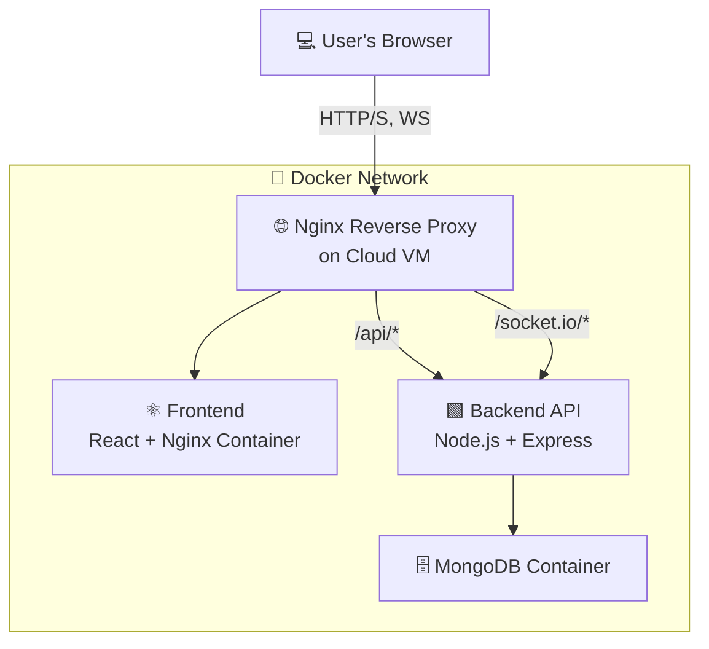
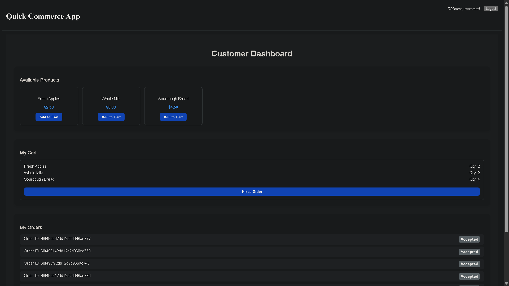
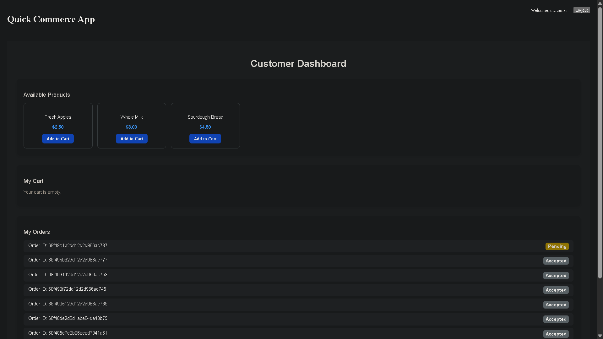
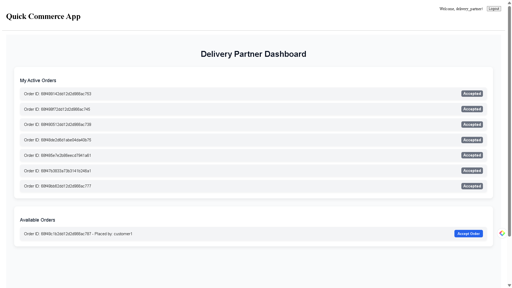
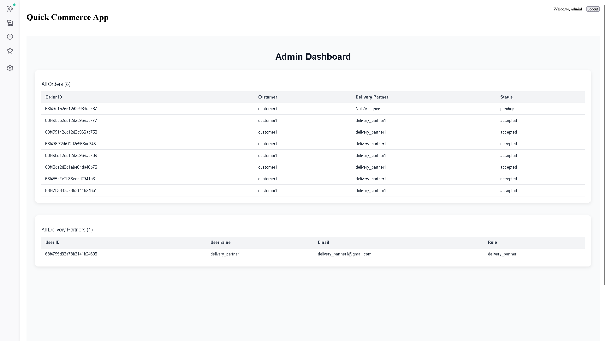

# 🏪 Real-Time Quick-Commerce

[](LICENSE)
[]()
[]()
[]()
[]()

---

## 📘 Project Overview

**Real-Time Quick-Commerce** is a full-stack application for **real-time order processing and delivery tracking**.

**Key Features:**

- **Customers:** Place and track orders in real-time
- **Delivery Partners:** Accept and manage deliveries
- **Administrators:** Monitor all operations

The app is fully **containerized with Docker** and deployable on a **cloud VM**.

---

## 🏗️ System Architecture

The application is deployed on a single cloud VM with **Nginx** as a reverse proxy.



---

## 🧰 Tech Stack

| Layer      | Technology                               |
| ---------- | ---------------------------------------- |
| Frontend   | React.js (Vite), Axios, Socket.io-client |
| Backend    | Node.js, Express.js, Mongoose, Socket.io |
| Database   | MongoDB                                  |
| Auth       | JSON Web Tokens (JWT)                    |
| Deployment | AWS EC2, Docker, Docker Compose          |

---

## 📁 Folder Structure

```bash
quick-commerce-app/
├── client/                  # React frontend
│   ├── public/
│   ├── src/
│   ├── Dockerfile           # Frontend image
│   └── nginx.conf           # Client-side routing
│
├── server/                  # Node.js backend
│   ├── controllers/
│   ├── models/
│   ├── routes/
│   ├── middleware/
│   ├── Dockerfile           # Backend image
│   └── nginx/
│       └── nginx.conf       # Reverse proxy config
│
├── docker-compose.yml       # Container orchestration
├── .gitignore
└── README.md
```

---

## ⚙️ Deployment Guide

### 1️⃣ SSH into Server

```bash
ssh -i /path/to/your-key.pem ubuntu@YOUR_PUBLIC_IP
```

### 2️⃣ Install Dependencies

```bash
sudo apt-get update -y
sudo apt-get install -y git docker.io
sudo systemctl start docker
sudo systemctl enable docker
sudo usermod -aG docker ubuntu
```

Install Docker Compose:

```bash
sudo curl -L "https://github.com/docker/compose/releases/download/1.29.2/docker-compose-$(uname -s)-$(uname -m)" -o /usr/local/bin/docker-compose
sudo chmod +x /usr/local/bin/docker-compose
```

> Log out and back in to apply group changes.

### 3️⃣ Clone the Repository

```bash
git clone https://your-github-repo-url.com/project.git
cd project
```

### 4️⃣ Configure Environment Variables

**Backend `.env`:**

```bash
MONGO_URI=mongodb://mongo:27017/quick-commerce-db
JWT_SECRET=YOUR_SUPER_SECRET_AND_LONG_RANDOM_STRING
PORT=5000
```

**Frontend `.env`:**

```bash
VITE_API_BASE_URL=/api
```

### 5️⃣ Build & Run Containers

```bash
docker-compose up --build -d
```

Access via your cloud VM’s public IP (HTTP port 80 / HTTPS port 443 if configured).

---

## 🧩 Useful Commands

```bash
# Stop containers
docker-compose down

# Rebuild only backend
docker-compose up --build backend -d

# View live logs
docker-compose logs -f
```

---

## 💡 Notes

- Ensure **Docker & Docker Compose** are installed correctly.
- Use **secure secrets** in production.
- For real deployment, use a **domain + SSL** (Nginx + Let’s Encrypt).

---

## 🧑‍💻 Contributor

**Vishal Kandu**
Full-Stack Developer | Real-Time Systems | Cloud & DevOps

---





